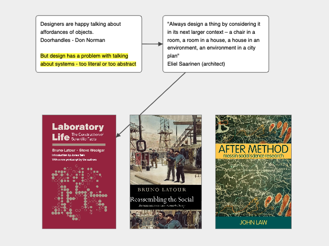

# OpenMind - Mind Mapping Software

Author: Christian Nold (2025) • Live App: https://softhook.github.io/OpenMind/

OpenMind is a fast, keyboard-driven mind mapping presentation app built with p5.js. 
Create, collaborate and present ideas with minimal hassle.

## Features
- Fullscreen distraction free mode
- Move between Editing and Presentation seamlessly. 

## Quick Start
- Here is an example map
https://softhook.github.io/OpenMind/#room=test

## Online Collaboration

OpenMind supports real-time collaborative editing using WebSocket synchronization. Multiple users can work on the same mind map simultaneously, seeing each other's changes instantly.

### Starting a Collaboration Session

- **Share a room**: Add `#room=yourRoomName` to the URL (e.g., `https://softhook.github.io/OpenMind/#room=myproject`)
- Share this URL with collaborators to work together in real-time
- Room names are case-sensitive and can contain letters, numbers, and common symbols

### Collaborative Features

- **Real-time sync**: All changes (boxes, connections, text edits) sync instantly across all connected users
- **Conflict-free editing**: Built on Yjs CRDTs to handle simultaneous edits without conflicts
- **Persistent rooms**: Rooms persist on the server - join anytime to see the latest state

### Privacy & Data

- No authentication required - anyone with the room URL can join

## Loading and Saving Maps
- Maps autosave in the browser 
- Click **Save** to download a JSON map.
- Click **Load** to import a saved JSON.
- Export your canvas via **Export PNG**, **Export PDF**, or **Export Text** from the menu.

### Keyboard Controls

- N: create a new box at the cursor
- Space: reverse the selected connection
- 0 or Home: reset view to fit all content
- Q: left-align all selected boxes (aligns to leftmost box's left edge)
- W: apply hierarchical layout to selected boxes (organizes based on connections)
- Backspace/Delete: delete selected box(es) or selected connection
- Cmd/Ctrl+C: copy selected box(es)
- Cmd/Ctrl+V: paste copied box(es) at the cursor location
- Cmd/Ctrl+Z: undo last action
- Cmd/Ctrl+Shift+Z or Cmd/Ctrl+Y: redo last undone action
- **Shift+T: toggle Easter egg thrust game** 🎮

### Undo/Redo Behavior

OpenMind provides intelligent, per-user undo/redo that works seamlessly in both solo and collaborative environments:

- **Action-based undo**: Each meaningful action (alignment, deletion, paste, etc.) creates one undo step
- **Smart text editing**: Continuous typing is grouped into a single undo step. Pausing for 1 second or clicking away creates an undo boundary
- **Per-user tracking**: In collaborative sessions, undo/redo only affects YOUR changes, not other users' changes
- **No time-based grouping**: Operations are never grouped automatically by time - each distinct action is separate

While editing a text box:

- Type to insert characters; Enter inserts a newline
- Backspace: delete character before the caret
- Delete (Fn+Backspace on macOS laptops): delete character after the caret

- Line deletion (macOS): Cmd+Backspace (to start of line), Cmd+Delete (to end of line)
- Selection and clipboard:
  - Cmd/Ctrl+A: select all text in the box
  - Cmd/Ctrl+C: copy selection
  - Cmd/Ctrl+X: cut selection
  - Cmd/Ctrl+V: paste
  - Cmd/Ctrl+B: toggle highlight on the selected text (adds/removes persistent highlight)

### Presentation Mode
- Arrow keys move the caret; Up/Down move between wrapped lines

### Mouse/Trackpad Controls
- Scroll over the canvas to zoom in/out around the cursor
- Hold Space (when not editing) and drag to pan the view
- Right-click and drag on empty canvas (when nothing is selected) to pan
- Click-drag on empty canvas (with nothing selected) to draw a selection rectangle; release to select boxes whose centers are inside; hold Shift to add to selection
- Click near a box edge to drag the box; click inside to edit text
- Drag the circular handle at the bottom-right of a box to resize it
- Create a connection: hover to show connector dots, click a connector dot on a box edge, then click another box
- Reattach a connection: drag its arrowhead to a different target box
- Click a connection to select it
- With a connection selected, press Space to reverse its direction

## Easter Egg 🎮

OpenMind includes a hidden mini-game!